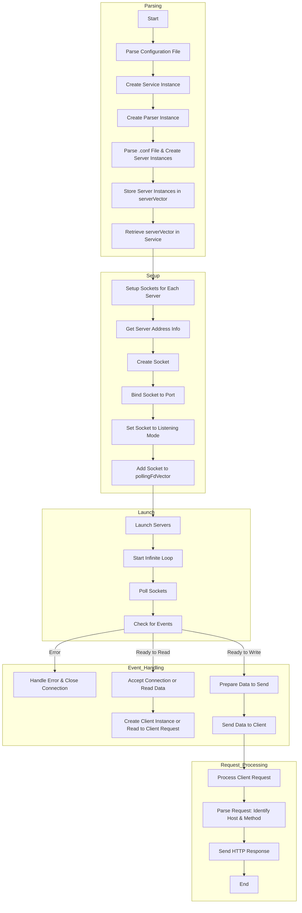

```table-of-contents
```
# En Français
## Comment Webserv fonctionne, bref aperçu

Il y a 3 étapes principales:
- **Parser** un fichier `.conf` pour obtenir les paramètres de chaque serveur (oui, il peut y en avoir plusieurs). Par exemple l'adresse et le port d'écoute se trouve dans le `server.conf`.
- **Setup** les (sockets des) serveurs. Chaque socket est lié à un port. Il s'agit in fine de créer les sockets d'écoute pour chaque serveur. et de les ajouter à la "liste de surveillance" (polling list) afin de détecter lorsqu'un client se connecte sur le socket.
- **Launch** les serveurs. C'est-à-dire lancer la boucle infinie qui :
	- attend que la liste de surveillance des sockets remonte un événement au système.
	- réagit à cet événement.
	Cette boucle comprend donc la communication Client-Server qui implique l'utilisation des méthodes HTML (GET; POST, DELETE) et l'utilisation des CGI.

## Structure du projet

Avant de détailler les étapes, il faut avoir une idée de la structure du projet.

Le projet comporte 4 classes:
- **Service**. Une classe est Service est instanciée en premier. Elle est centrale car elle fait le lien entre les étapes Parsing/Setup/Launch puis fait la surveillance des sockets. Elle contient (notamment) les variables suivantes:
	- la liste des serveurs (un vecteur)
	- la liste des clients (un vecteur)
	- la liste de surveillance des sockets (un vecteur)
- **Parser**. Une seule instance de la classe Parser est créé par l'instance de Service. La classe comporte toutes les fonctions de parsing et variables temporaires qui permettront de créer les instances de la classe Server.
- **Serveur**. Le fichier de configuration `.conf` contient des "blocs" serveurs (`server { ... }`avec des paramètres. Une instance de la classe Server est créé pour chaque bloc et contient les différents paramètres parsés.
- **Client**. A chaque connexion d'un client au serveur, une instance de la classe Client est créée . Elle contient toutes les informations concernant le client (notamment):
	- le serveur auquel le client est connecté ()
	- le socket du client
	- la requête du client

## Plus en détails, plus proche du code
### Step 1: Parsing
1. Main instancie `Service` avec le fichier`server.conf` 
2. Le constructeur de `Service` instancie un `Parser` qui lit le fichier `.conf` pour analyser chaque bloc `server{}`. 
3. `Parser` créé une instance de `Serveur` pour chaque bloc `server{}`. Ces instances sont stockées dans le `serverVector`.
4. `Service` récupère le `serverVector` en provenance de `Parser`.
### Step 2: Setup

1. `main` appelle la méthode `setup()` de `Service`.
2. L'instance de `Service` exécute pour **chaque serveur** se trouvant dans `serverVector`, :
	a. `getaddrinfo()` pour obtenir les informations d'adresse du serveur,
	b. `socket()` pour créer un socket. 
	c. `bind` pour lier le socket à un port.
	d. `listen()` pour mettre le socket en mode écoute.
	e. puis ajoute le socket au vecteur `pollingFdVector` pour le surveiller ultérieurement.
### Step 3: Launch
1. `main` appelle la méthode `launch()` de `Service` 
2. `launch()` exécute **en boucle** (en attendant le signal d'extinction) :
	a.`poll()` pour lancer la surveillance des sockets (plus précisément des files descriptors liées au socket). 
	- `poll()`prend `pollingFdVector` en entrée puis se bloque.
	- `poll()` se débloque lorsqu'un socket remonte un événement ou lorsque qu'un "timeout" est atteint.
	- `poll()` se débloque et permet d'exécuter la suite des instructions mais **il ne dit pas quel est le socket ni quel est le type d'événement qui s'est produit**.
	b.`PollingManager()` pour parcourir les sockets afin de déterminer quel socket a remonté quel type d'événement afin d'envoyer des données ou de recevoir des données.

#### Step 3: PollingManager() - gestion des événements des sockets

Il y a 3 types d'événements pouvant être remonté par un socket: erreur, prêt à lire, prêt à écrire.

A. Le socket a une **erreur** (_POLLERR_, _POLLHUP_, _POLLNVAL_). Alors l'erreur est traitée avec un message d'erreur et la fermeture de connexion.

B. Le socket annonce qu'il est prêt pour la **lecture de données** (_POLLIN_). Cela signifie qu'il a quelque chose à lire dans son buffer. L'action dépend du type de socket.
- Si c'est un socket de **serveur** (qui écoute les connexions, donc configuré avec `listen()`), alors la connexion est `accept()`. (Initialement, il n'y a que des sockets de serveur)
	- `accept()`retourne un nouveau socket (file descriptor) dédié au nouveau client. 
	- Ce file descriptor est ajouté au `pollingFdVector` pour être surveillé par `poll()`
	- Une nouvelle instance de `Client` est créée.
- Si c'est un socket de **client** (qui représente une connexion existante), les données envoyées par le client sont lues avec `recv()` et ajoutées à la variable `_request` de l'instance `Client`.

C. Si le socket du serveur est prêt pour l'**envoi de données** (_POLLOUT_) cela signifie que le buffer est vide et donc prêt à être remplie avec des informations à transmettre au client. 

#### Step 3: Traitement de la requête et envoie de données

Le principe est le suivant.
1. Le client envoie une requête HTML, par exemple:

```
GET /index.html HTTP/2
Host: www.example.com
```

2. Le serveur parse la requête (`_request`)pour identifier:
	- l'hôte (`Host`). Il faut vérifier que l'hôte est existe dans la liste des serveurs `serversVector`
	- la méthode `GET / POST /DELETE`
3. Envoyer la réponse qui comprend:
	- Statut : code indiquant le résultat de la requête (200 OK, 404 Not Found, etc.).
	- En-têtes : informations sur la réponse (type de contenu, date, etc.).
	- Corps : données renvoyées par le serveur (HTML, JSON, etc.).

**Exemple de réponse HTTP :**

```http
HTTP/1.1 200 OK
Content-Type: text/html
Content-Length: 138

<html>
<body>
<h1>Hello, World!</h1>
</body>
</html>
```

-------------

# In english (thanks chatGPT)
## How Webserv Works: Quick Overview

There are three main steps:

1. **Parse** a `.conf` file to get the settings for each server (there can be multiple servers). For example, the listening address and port are in `server.conf`.
2. **Setup** the server sockets. Each socket is linked to a port. This involves creating listening sockets for each server and adding them to a "polling list" to detect when a client connects to a socket.
3. **Launch** the servers. This means starting an infinite loop that:
   - Waits for the polling list to report an event to the system.
   - Reacts to that event.
   
   This loop includes client-server communication, using HTML methods (GET, POST, DELETE), and CGI.

## Project Structure

Before detailing the steps, it's important to understand the project structure.

The project has four classes:

- **Service**: This class is instantiated first. It's central as it links the Parsing/Setup/Launch steps and monitors the sockets. It contains:
  - A list of servers (a vector).
  - A list of clients (a vector).
  - A polling list for sockets (a vector).
- **Parser**: Only one instance is created by the Service instance. It contains all parsing functions and temporary variables to create Server instances.
- **Server**: The `.conf` file contains server "blocks" (`server { ... }` with parameters). An instance of the Server class is created for each block and contains parsed parameters.
- **Client**: Each time a client connects to the server, a Client instance is created. It contains information about the client, including:
  - The server to which the client is connected.
  - The client's socket.
  - The client's request.

## In Detail, Closer to Code

### Step 1: Parsing

1. Main creates `Service` with `server.conf`.
2. `Service` constructor creates a `Parser` that reads the `.conf` file to analyze each `server{}` block.
3. `Parser` creates a `Server` instance for each `server{}` block. These instances are stored in `serverVector`.
4. `Service` retrieves `serverVector` from `Parser`.

### Step 2: Setup

1. `main` calls the `setup()` method of `Service`.
2. For **each server** in `serverVector`, `Service` instance executes:
   - `getaddrinfo()` to get server address info.
   - `socket()` to create a socket.
   - `bind` to link the socket to a port.
   - `listen()` to set the socket to listening mode.
   - Adds the socket to `pollingFdVector` to monitor it later.

### Step 3: Launch

1. `main` calls the `launch()` method of `Service`.
2. `launch()` runs **in a loop** (until a shutdown signal) and:
   - `poll()` to monitor sockets (specifically file descriptors linked to sockets).
   - `poll()` takes `pollingFdVector` as input and blocks.
   - `poll()` unblocks when a socket reports an event or a timeout is reached.
   - `poll()` unblocks but **doesn't specify which socket or event type occurred**.
   - `PollingManager()` checks sockets to determine which socket triggered which event to handle data sending or receiving.

#### Step 3: PollingManager() - Socket Event Management

Three event types can be reported by a socket: error, ready to read, ready to write.

A. If a socket has an **error** (_POLLERR_, _POLLHUP_, _POLLNVAL_), the error is handled with an error message and connection closure.

B. If a socket is ready for **data reading** (_POLLIN_), it has data in its buffer. Action depends on socket type:
   - For a **server** socket (listening for connections, set with `listen()`), the connection is `accept()`.
     - `accept()` returns a new socket (file descriptor) for the new client.
     - This file descriptor is added to `pollingFdVector` for `poll()` to monitor.
     - A new `Client` instance is created.
   - For a **client** socket (representing an existing connection), data sent by the client is read with `recv()` and added to the `Client` instance's `_request` variable.

C. If a server socket is ready for **data sending** (_POLLOUT_), the buffer is empty and ready to be filled with information to send to the client.

#### Step 3: Request Processing and Sending Data

The process is as follows:

1. The client sends an HTML request, for example:

   ```
   GET /index.html HTTP/2
   Host: www.example.com
   ```

2. The server parses the request (`_request`) to identify:
   - The host (`Host`). It verifies if the host exists in the `serversVector`.
   - The method (GET, POST, DELETE).

3. The server then sends a response, which includes:
   - **Status**: A code indicating the result of the request (e.g., 200 OK, 404 Not Found).
   - **Headers**: Information about the response (content type, date, etc.).
   - **Body**: The data returned by the server (HTML, JSON, etc.).

**Example of an HTTP response:**

```http
HTTP/1.1 200 OK
Content-Type: text/html
Content-Length: 138

<html>
<body>
<h1>Hello, World!</h1>
</body>
</html>
```


# Diagram


